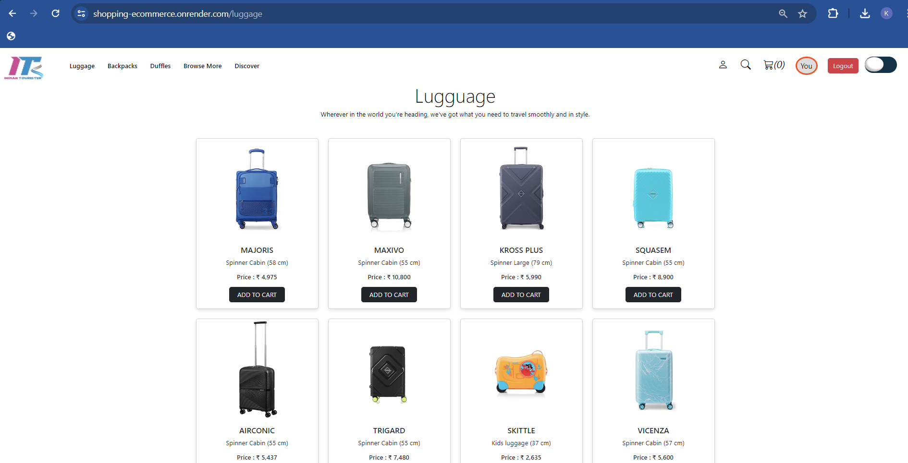

# shopping-ecommerce ⬇️

Click here to visit our E-Commerce Shopping Application: My E-Commerce Website 🙂

visit:Link: https://shopping-ecommerce.onrender.com

## Preview Of Shopping-Ecommerce 🙂

## Introduction ✒️

Built with the robust MERN stack and Redux for state management, our application offers a wide range of features including user authentication, search functionality, a user dashboard, theme customization, user registration and login, and an intuitive cart functionality.

The frontend of the application is crafted with React, Redux, React Router DOM, Context API, Axios, Bootstrap, Bootstrap Icons, React-toastify, and Vite. These technologies ensure a dynamic, responsive, and user-friendly interface.

The backend of the application is powered by Node.js, Express, MongoDB, and Mongoose, providing a secure and efficient data management system. Additional technologies like Bcrypt, Cookie-parser, Jsonwebtoken, Express-async-handler, and Nodemon are used to enhance security and performance.

## Libraries Used

This project uses the following libraries:

### Frontend

- **React**: A JavaScript library for building user interfaces
- **Redux**: A Predictable State Container for JS Apps
- **React Router DOM**: DOM bindings for React Router
- **Context API**: Provides a way to pass data through the component tree without having to pass props down manually at every level
- **Axios**: Promise based HTTP client for the browser and node.js
- **Bootstrap**: The most popular HTML, CSS, and JS library in the world
- **Bootstrap Icons**: Official open source SVG icon library for Bootstrap
- **React-toastify**: Allows you to add notifications to your app with ease
- **Vite**: A build tool that aims to provide a faster and leaner development experience for modern web projects

## Features 🥰
- User authentication and authorization
- Search functionality
- User dashboard
- Theme customization
- User registration and login
- Add to cart and remove from cart functionality
- Change Password Using Our Email
- Deactivate Account
- logout Using Logout Button

  ## Technologies Used

  ### Frontend

- React: A JavaScript library for building user interfaces
- Redux: A Predictable State Container for JS Apps
- React Router DOM: DOM bindings for React Router
- Context API: Provides a way to pass data through the component tree without having to pass props down manually at every level
- Axios: Promise based HTTP client for the browser and node.js
- Bootstrap: The most popular HTML, CSS, and JS library in the world
- Bootstrap Icons: Official open source SVG icon library for Bootstrap
- React-toastify: Allows you to add notifications to your app with ease
- Vite: A build tool that aims to provide a faster and leaner development experience for modern web projects

  ### Backend

- Node.js: A JavaScript runtime built on Chrome's V8 JavaScript engine
- Express: Fast, unopinionated, minimalist web framework for Node.js
- MongoDB: The database for modern applications
- Mongoose: Elegant mongodb object modeling for node.js
- Bcrypt: A library to help you hash passwords
- Cookie-parser: Parse Cookie header and populate req.cookies with an object keyed by the cookie names
- Jsonwebtoken: An implementation of JSON Web Tokens
- Express-async-handler: A simple middleware for handling exceptions inside of async express routes
- Nodemon: A utility that will monitor for any changes in your source and automatically restart your server

## Setup back-end
Follow these steps to set up and run the application

1. **Clone the repository**: First, clone the repository to your local machine.

2. **Install Node Modules**: Navigate to the project directory and run the following command to install the necessary node modules:

3. "start the server**: npm run server

## Setup front-end
Follow these steps to set up and run the application 

**Install Node Modules**: Navigate to the project directory and run the following command to install the necessary node modules:
  npm install node-modules
  
**start React:** Finally, start the React application by running the following command:
  npm run dev
  
